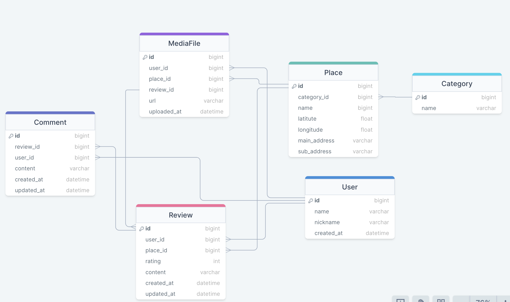
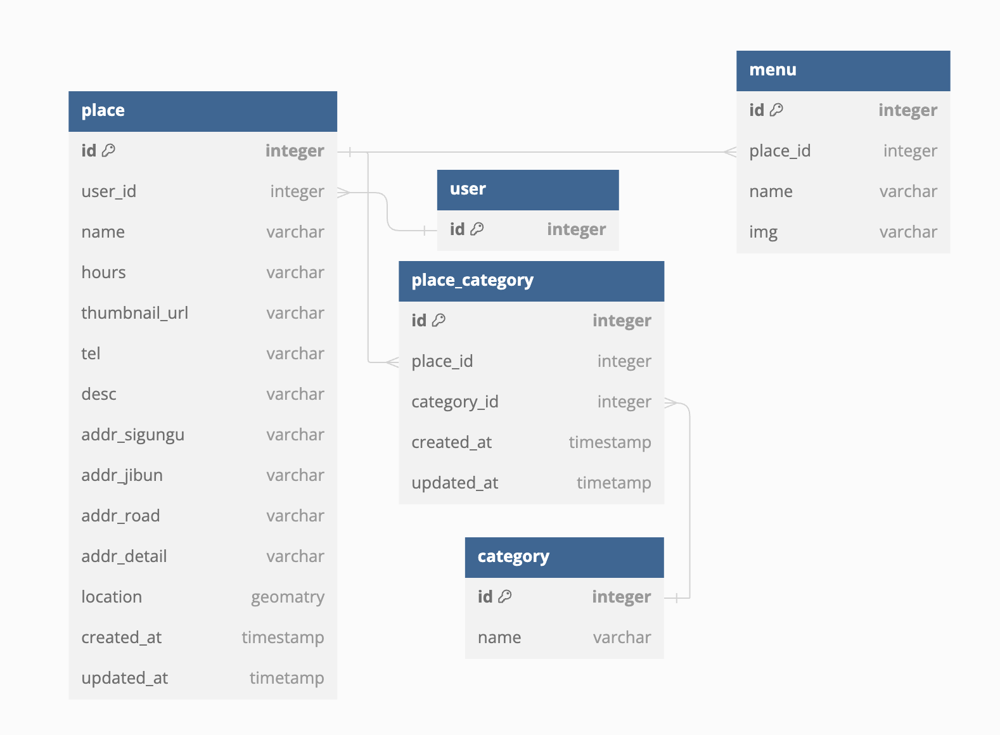

# daedongmap-BackEnd
주제
- 인스타그램 형식의 맛집 리뷰 SNS
- 리뷰한 맛집을 지도로 표현함으로써 위치 기반으로 맛집을 찾고 공유

기간 : 2024년 4월 15일 ~ 2024년 5월 24일

## 팀원
- - -
### 백엔드
- 고상현: 사용자
- 유하진: 게시글, 댓글, 사진
- 이도길: 음식점, 음식점 카테고리

### 프론트엔드
- 안보란
- 윤수화
- 최종현

## 사용기술
- - -
### 프론트엔드
- , , , , , 
### 백엔드
- , , , , 

## ERD
- - -
### 사용자

### 리뷰, 댓글, MediaFile

### 음식점, 분류

## 와이어프레임
- - -
🔗[피그마 링크](https://www.figma.com/file/biEYWl2SSSEFUrQWyUKAy6/%ED%81%B4%EB%9D%BC%EC%9A%B0%EB%93%9C1%EA%B8%B0-%EC%B5%9C%EC%A2%85%ED%94%84%EB%A1%9C%EC%A0%9D%ED%8A%B8-%EB%A7%9B%EC%A7%91%EC%A7%80%EB%8F%84SNS---%EB%8C%80%EB%8F%99%EB%A7%9B%EC%A7%80%EB%8F%84?type=design&node-id=0-1&mode=design)

## 기능 명세
- - -

세부 내역

- 회원
    - 로그인/ 로그아웃 + OAuth
    - 회원가입, 수정, 탈퇴
        - 이메일, 닉네임 중복 확인
    - jwt + refresh token
- 지도 연동 API
    - 핀 찍기
    - 위치 검색
    - 음식점 검색
- 리뷰 - 맛집 리뷰 등록
    - 쓰기, 수정, 삭제
    - 댓글 쓰기, 수정, 삭제
    - 리뷰에 사진 등록
    - 처음 접속 시 현재 위치 기준으로 표시 (추천순, 리뷰순)
    - OR 빈 지도 보여주고 음식 종류별로 누르면 보여주기
- 검색 기능, 정렬
    - 사용자별로, 지역별로 자기 위치 중심으로
    - 추천순으로, 테마별로, 음식별로 정렬
    - 태그 검색
- 알림 기능
  - 내 리뷰와 좋아요가 눌리거나 팔로우가 왔을 때 알림

  
